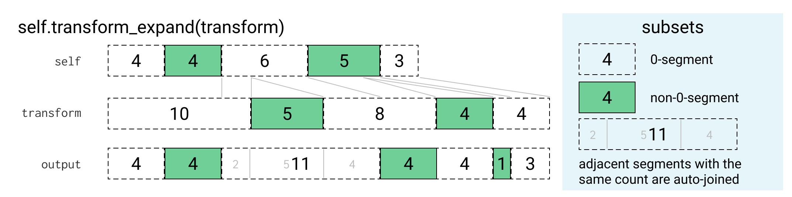
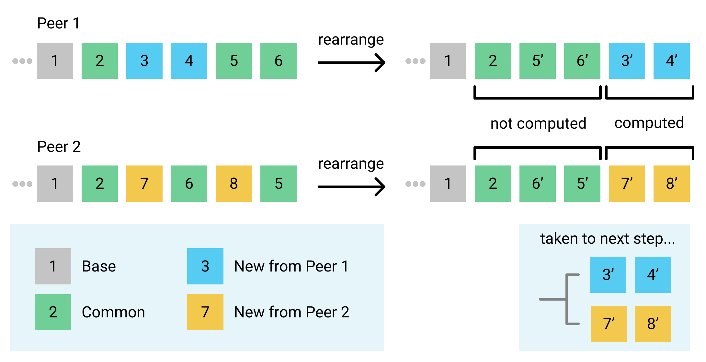

<!-- See https://www.figma.com/file/UGOAcpKR5WIP81t3DGPIP2dR/CRDT-Merge-Diagrams for the source of the diagrams -->

This document contains a detailed description of the data structures and operations Xi uses for text. These data structures and the `merge` operation also form a Conflict-free Replicated Data Type (CRDT). It being a CRDT allows Xi to be used for concurrent editing of text on multiple devices, it can merge edits, including those made offline, between multiple devices and converge on a consistent document that includes all changes.

Beyond synchronizing text, these data structures and operations allow Xi to handle asynchronous editing of the text from plugins, support undo and redo, and allow incremental updating of editor state and the view based on differences between revisions.

Many of these data structures and operations have been in Xi for a while but they've recently been heavily overhauled and extended as part of [a project](https://github.com/xi-editor/xi-editor/issues/250) that added multi-device syncing support via the CRDT merge operation. This was done for [use on the Fuchsia operating system](https://fuchsia.googlesource.com/topaz/+/master/bin/xi/), where it uses [Ledger](https://fuchsia.googlesource.com/peridot/+/HEAD/docs/ledger) to synchronize documents between devices.

What follows is both a description of a data structure for text and a code tour of the `xi-rope` crate. It describes the actual Rust data structures and algorithms used, because the primary novelty and difficulty of this CRDT is in the optimized representation that allows for better time and memory complexity. If you want an overview of the motivation behind using a CRDT and a conceptual description of what the CRDT does see [`crdt.md`](crdt.md). The intended audience is anyone interested in implementing CRDTs, anyone who wants to work on Xi, or just anyone curious enough.

## Table of Contents

- [Motivation](#motivation): Why Xi's CRDT is the way it is.
- [Representation](#representation): Describes the representation Xi uses to implement the CRDT in a memory and time efficient way.
- [Operations](#operations): Describes all the operations implemented on the representation to allow it to support undo, asynchronous edits, distributed synchronization and more.
    - [Engine::merge](#enginemerge): Description of the CRDT merge operation used for multi-device syncing.

## Motivation

The Xi CRDT attempts to have a number of properties that many other asynchronous text editing solutions don't:

- Usable without a central server: Even though the Fuchsia Ledger does sync to a cloud server, it can't actually inspect the data or perform operations, so conflict resolution must be possible on every device independently.
- Support large documents: The memory complexity of the representation and the time complexity of common operations should be low enough to support very large text documents like books or long code files.
- Support long histories: Similarly, documents that have gone through many edits should be efficient to edit both in time and memory.

As of the time this document was written, it satisfies all of these properties to some extent, but some operations and representations are not as memory and time efficient as we'd like. However, everything has been designed with a few more key optimizations in mind. Those optimizations should bring the memory and time complexity down to where we want.

### Transform Property 2 (TP2) and Operational Transforms

[Operational Transformation (OT)](https://en.wikipedia.org/wiki/Operational_transformation) is a common way to implement asynchronous text editing. It works by sending *operations* like inserts and deletes between peers and transforming them to apply to the current text. Unfortunately many implementations of OT have a problem where they don't always preserve ordering when text is deleted.

For example see the following diagram showing 3 peers sending edits between each other ending up in an inconsistent state. The arrows represent operations being sent asynchronously between devices in a peer-to-peer editing system based on OT, with time progressing downward. Whenever an edit is made the operation is sent to all other peers, but due to asynchronous communication they can be arbitrarily delayed. When an operation arrives at a peer it is transformed and applied to the current text. For clarity, not all arrows are shown, but you can imagine that the arrival of missing sends just got delayed past the end of the diagram.


Acting consistently in cases like this is called having "Transform Property 2" (see [Operational Transformation in Real-Time Group Editors:
Issues, Algorithms, and Achievements](http://citeseerx.ist.psu.edu/viewdoc/download?doi=10.1.1.53.933&rep=rep1&type=pdf) by Sun & Ellis, 1998). One approach to the problem is to serialize all edits through a central server which does all the transformation. With this approach, the ordering relative to deleted text may not be preserved, but at least all clients will converge to the same state. This is what Google Docs and many other collaborative editing systems do.

Xi avoids this problem by using "tombstones" (see [Tombstone Transformation Functions for Ensuring Consistency in Collaborative Editing Systems](http://citeseerx.ist.psu.edu/viewdoc/download?doi=10.1.1.103.2679&rep=rep1&type=pdf)), which leave deleted characters in the representation so that ordering can be preserved. This will be described in detail later.

## Representation

The conceptual representation described in [`crdt.md`](crdt.md) would be very inefficient to use directly. If we had to store an ID and ordering edges for each character and reconstruct the current text via topological sort every time we wanted to know what the current text is, Xi would be incredibly slow and would use much more memory than is necessary.

Instead, we use a representation that allows all the operations we care about to be fast. We also take advantage of the typical patterns of text document usage to make the representation more memory efficient for common cases.

The key optimization that shapes everything else is to avoid using IDs for characters or storing ordering edges explicitly. Instead, we represent the identity of characters implicitly by their position in the current text. But then how do we reference them in our revision history? If we use indices into the current text, they will get outdated by changes. We could rewrite all the indices in the history every time we made an edit, but that would be terribly inefficient. Instead the set of inserted characters in every revision is treated as a *coordinate transform* for the older revisions. In order to find the character referred to by an older revision you have to transform the indices it uses based on the insertions made after it. This allows us to make our history append-only, leaving the indices referring to the text at the time of the revision.

That description is almost certainly too vague to be understandable at this point, but don't worry, there will be a full description with diagrams later on.

Starting from the basic building blocks and proceeding towards the top level CRDT `Engine`, here are all the structures:

### Rope

```rust
pub struct Rope(Arc<RopeBody>);

#[derive(Clone)]
struct RopeBody {
    /// Used for efficiently seeking to an index in the tree
    len: usize,
    /// Used for rebalancing
    height: usize,
    val: RopeVal,
}

enum RopeVal {
    Leaf(String),
    Internal(Vec<Rope>),
}
```
**Note:** All the Rust code in this document is simplified from the actual implementation so that it still conveys the structure and memory properties of the representation but elides details not necessary to understand the CRDT. See the code or generated docs for the full definitions. For example, the real struct for `Rope` is called `Node<N: NodeInfo>` and is a generic structure not specific to text, that is later instantiated for text as `pub type Rope = Node<RopeInfo>`.

When representing potentially large amounts of text, Xi avoids using `String`s and instead uses a data structure called `Rope`. This is essentially an immutable `String` except many operations that would be `O(n)` with normal strings are instead `O(log n)` or `O(1)`. Some examples of operations like this:

- Copying
- Extracting a substring by index
- Inserting one piece of text in the middle of another producing a new piece of text
- Deleting an interval from a piece of text, producing a new piece of text

Behind the scenes, `Rope` is an immutable balanced tree structure using Rust's atomic reference counting smart pointer (`Arc`) to share data, so "copying" any sub-tree is a very fast `O(1)` operation. The leaves of the tree are chunks of text with a maximum size.

An example of a `O(log n)` operation is deleting an interval of a `Rope`, which only requires creating a few new nodes that reference the sub-trees to the right and left of the deleted interval, and creating up to two new leaves if the deleted interval doesn't lie on chunk boundaries.

Obviously `Rope`s will be slower and take more memory than small `Strings` but they have an asymptotic advantage when working with large documents.

For a deeper look at `Rope`s see the [Rope Science](rope_science_00.md) series.

### Subset

```rust
struct Segment {
    len: usize,
    count: usize,
}

pub struct Subset {
    /// Invariant, maintained by `SubsetBuilder`: all `Segment`s have non-zero
    /// length, and no `Segment` has the same count as the one before it.
    segments: Vec<Segment>,
}
```

The `Subset` structure in `multiset.rs` represents a multi-subset of a string, meaning that every character in the string has a count (often `0`) representing how many times it is in the `Subset`. Most of the time this structure is used to represent plain-old subsets and the counts are only ever `0` for something not in the set or `1` for a character in the set. It is primarily used to efficiently represent inserted and deleted regions of a document.

**Note:** The exact nature of the characters is not central to the CRDT algorithm. It's most convenient for indices to match the representation, so throughout this document "characters" are actually counting UTF-8 code units, so for example an emoji would be multiple "characters" in this sense.

It stores this information compactly as a list of consecutive `Segment`s with a `length` and a `count`. This way a `Subset` representing 1000 consecutive characters in the middle of a string will only require 3 segments (a 0-count one at the start, a 1-count one in the middle, and another 0-count one at the end). So as `(len, count)` tuples this would look like: `(n, 0), (1000, 1), (m, 0)`.

The primary reason that `Subset`s can have counts greater than `1` is to represent concurrent deletes, for example if two concurrent edits delete the same character, and one of them is undone, subtracting one of the deletes from the `Subset` of deleted characters should still leave the character deleted once. For this reason, the `Subset`s of deleted characters which are described later have counts that represent how many times each character has been deleted.

Note that an "empty" `Subset` where all the characters have count `0` is still represented as a single segment with the length of the base string and count set to `0`. This allows functions using `Subset`s to panic if they are used with strings or other `Subset`s of the wrong length. This gives a level of dynamic checking that algorithms are using `Subset`s correctly.

### Delta

```rust
enum DeltaElement {
    /// Represents a range of text in the base document. Includes beginning, excludes end.
    Copy(usize, usize),
    Insert(Rope),
}

pub struct Delta {
    els: Vec<DeltaElement>,
    /// The total length of the base document, used for checks in some operations
    base_len: usize,
}

pub struct InsertDelta(Delta);
```

A `Delta` represents the difference between one string (*A*) and another (*B*). It stores this as a list of intervals copied from the *A* string and new inserted sections. All the indices of the copied intervals are non-decreasing. So a deletion is represented as a section of the *A* string which isn't copied to the *B* string, and insertions are represented as inserted sections in between copied sections. `Delta` is the data structure the text editor interface creates when the user or a plugin edits the document, these are then applied to the document by the `Engine::edit_rev` operation described later.

There is also a type `InsertDelta` that is just a wrapper around a `Delta` but represents a guarantee that the `Delta` only inserts, that is, the entire *A* string is copied by the `Copy` intervals.

### Text, tombstones and the "union string"

A super important part of being able to provide the properties we desire in our CRDT is that we never throw useful information away. This means that when you delete text in Xi, or undo an insert, the text doesn't actually get thrown away, just marked as deleted. You can think of this as if there is a "union string" that contains all the characters that have ever been inserted, with some marked as deleted.

When we delete or undo, we don't touch the union string, we just change a `Subset` (`deletes_from_union`, more on that later) which marks which characters of the union string are deleted. These deleted characters are sometimes called "tombstones" both within Xi and the academic CRDT literature.

If we wanted to go from the "union string" to the current text of the document, you'd delete the characters marked in `deletes_from_union` from the union string. The problem is, Xi access the current text **very often**, so this would be an inefficient way to actually store the text for large documents.

As an optimization, we store the union string as two separate parts: `text` and `tombstones`. The `text` stores the current visible document contents, so it is really fast to access, and `tombstones` stores all the characters that are currently in the `deletes_from_union` set. We still store the `deletes_from_union` set to mark deleted characters. Note that the union string is still used for most indices as a coordinate space for `Subset`s like `deletes_from_union`.

Here's an example of what this looks like:

```
union string:       abcdefgh
deletes_from_union: -+---+-+
text:               acdeg
tombstones:         bfh
```

We can now also look at `deletes_from_union` as describing the interleaving of characters from `text` and `tombstones`:

```
text:               a cde g
deletes_from_union: -+---+-+
tombstones:          b   f h
```

The union string is still an important and useful concept because it makes a lot of the operations easier to implement and understand. Almost all explanations will be in terms of the union string, if you want you can largely ignore that fact that it's actually stored as two separate parts. Most operations are done in terms of the union string and then at the very end they shuffle some things around between the current `text` and `tombstones`.

### Revision

```rust
struct Revision {
    /// This uniquely represents the identity of this revision and it stays
    /// the same even if it is rebased or merged between devices.
    rev_id: RevId,
    /// The largest undo group number of any edit in the history up to this
    /// point. Used to optimize undo to not look further back.
    max_undo_so_far: usize,
    edit: Contents,
}

enum Contents {
    Edit {
        /// Used to order concurrent inserts, for example auto-indentation
        /// should go before typed text.
        priority: usize,
        /// Groups related edits together so that they are undone and re-done
        /// together. For example, an auto-indent insertion would be un-done
        /// along with the newline that triggered it.
        undo_group: usize,
        /// The subset of the characters of the union string from after this
        /// revision that were added by this revision.
        inserts: Subset,
        /// The subset of the characters of the union string from after this
        /// revision that were deleted by this revision.
        deletes: Subset,
    },
    Undo {
        /// The set of groups toggled between undone and done.
        /// Just the `symmetric_difference` (XOR) of the two sets.
        toggled_groups: BTreeSet<usize>,  // set of undo_group id's
        /// Used to store a reversible difference between the deleted
        /// characters before and after this operation.
        deletes_bitxor: Subset,
    }
}
```

`Revision`s represent a single edit to the document. Typing a character into a Xi document will create a new `Revision` with a `Contents::Edit` with an empty `deletes` subset and an `inserts` subset containing the character inserted.

They can also represent more complex things like selecting multiple ranges of text using multiple cursors (which Xi supports) and then pasting. This would result in a `Contents::Edit` with an `inserts` subset containing multiple separate segments of pasted characters, and a `deletes` subset containing the multiple ranges of previous text that were replaced.

Note that the `inserts` and `deletes` `Subset`s are based on the union string from after the `Revision` is applied. The fact that the union string includes deleted characters allows insertions and deletions to maintain their position easily in the face of concurrency and undo. For example, say I have the text "ac" and I change it to "abc", but then undo the first edit leaving "b". If I re-do the first edit, Xi needs to know that the "b" goes between the two deleted characters. You might be able to think of ways to do this with other coordinates, but it's much easier and less fraught when coordinates only change on insertions instead of insertions, deletions and undo.

A key property of `Revision`s is that they contain all the necessary information to apply them as well as reverse them. This is important both for undo and also for some operations we'll get to later. This is why `Contents::undo` stores the set of toggled groups rather than the new set of undone groups. It's also why it stores a reversible set of changes to the deleted characters (more on those later), this could be found by replaying all of history using the new set of undo groups, but then it would be inefficient to apply and reverse (because it would be proportional to the length of history).

### RevId & RevToken

```rust
pub struct RevId {
    // 96 bits has a 10^(-12) chance of collision with 400 million sessions and 10^(-6) with 100 billion.
    // `session1==session2==0` is reserved for initialization which is the same on all sessions.
    // A colliding session will break merge invariants and the document will start crashing Xi.
    session1: u64,
    // if this was a tuple field instead of two fields, alignment padding would add 8 more bytes.
    session2: u32,
    // There will probably never be a document with more than 4 billion edits
    // in a single session.
    num: u32,
}

/// Valid within a session. If there's a collision the most recent matching
/// Revision will be used, which means only the (small) set of concurrent edits
/// could trigger incorrect behavior if they collide, so u64 is safe.
pub type RevToken = u64;
```

`RevId` is used to uniquely identify the revision. The trick is offline devices have to be able to generate non-colliding IDs, which they do by generating random "session IDs" that become part of their revision numbers for that execution, with `num` being just an incrementing counter. The reason the IDs aren't fully random is so that eventually we can delta-compress them and the IDs will take on average 1 bit per revision instead of 128 bits. This is only necessary for the multi-device syncing case, in the single-device case the session ID is always `(1,0)`.

`RevToken` is used to make the API simpler, it is just the hash of a `RevId`. This makes things easy for plugins and other things that need to reference revisions.


### Engine

```rust
/// Represents the current state of a document and all of its history
pub struct Engine {
    /// The session ID used to create new `RevId`s for edits made on this device
    session: SessionId,
    /// The incrementing revision number counter for this session used for `RevId`s
    rev_id_counter: u32,
    /// The current contents of the document as would be displayed on screen
    text: Rope,
    /// Storage for all the characters that have been deleted  but could
    /// return if a delete is un-done or an insert is re- done.
    tombstones: Rope,
    /// Imagine a "union string" that contained all the characters ever
    /// inserted, including the ones that were later deleted, in the locations
    /// they would be if they hadn't been deleted.
    ///
    /// This is a `Subset` of the "union string" representing the characters
    /// that are currently deleted, and thus in `tombstones` rather than
    /// `text`. The count of a character in `deletes_from_union` represents
    /// how many times it has been deleted, so if a character is deleted twice
    /// concurrently it will have count `2` so that undoing one delete but not
    /// the other doesn't make it re-appear.
    ///
    /// You could construct the "union string" from `text`, `tombstones` and
    /// `deletes_from_union` by splicing a segment of `tombstones` into `text`
    /// wherever there's a non-zero-count segment in `deletes_from_union`.
    deletes_from_union: Subset,
    undone_groups: BTreeSet<usize>,  // set of undo_group id's
    /// The revision history of the document
    revs: Vec<Revision>,
}

/// the session ID component of a `RevId`
pub type SessionId = (u64, u32);
```

`Engine` is the top-level container of text state for the CRDT. It stores the current state of the document and all the `Revision`s that lead up to it. This allows operations that require knowledge of history to apply `Revision`s in reverse from the current state to find the state at a point in the past, without having to store the state at every point in history. Be sure to read the code in this case, all the fields are described by doc comments.

**SUPER IMPORTANT INSIGHT:** Because the union string preserves the textual ordering of inserted characters, indices in the union string only depend on the set of inserted characters and not what order they were added in the history. This means that the correct representation of a `Revision` for a given edit *doesn't depend on the order* of `Revision`s before it in the history, only what *set* of `Revision`s is before it.

### Example History

Bringing it all together, here's a sketch of how a simple editing scenario would be represented this way.


Shown below is a longer history of `Edit` `Revision`s. At each point, the `inserts` and `deletes` `Subset`s of the `Revision` that was just added are shown. Below that is what the contents of `Engine` would be immediately after that `Revision` was added to it.

Also included is a "Concepts" section that includes things that aren't actually stored but are useful for understanding the representation. This includes the "union" string that all indices are based on. It also includes `back_computed_deletions_from_6_union`, which is like `deletes_from_union` except instead of being based on the union at the time of the edit, it is based on the union of `Revision` 6. This shows that since we never throw away information, we can represent the `text` at any past `Revision` as a set of deletions from the union string of any later revision.

```
()  Revision: before any revisions are made
    Engine:   text="" tombstones="" deletes_from_union={}
    Concepts: union="" back_computed_deletions_from_6_union={0,1,2,3,4,5}
(1) Revision: inserts={0, 1, 2} deletes={}
    Engine:   text="123" tombstones="" deletes_from_union={}
    Concepts: union="123" back_computed_deletions_from_6_union={0,1,2}
(2) Revision: inserts={} deletes={0, 1, 2}
    Engine:   text="" tombstones="123" deletes_from_union={0,1,2}
    Concepts: union="123" back_computed_deletions_from_6_union={0,1,2,3,4,5}
(3) Revision: inserts={0} deletes={}
    Engine:   text="a" tombstones="123" deletes_from_union={1,2,3}
    Concepts: union="a123" back_computed_deletions_from_6_union={1,2,3,4,5}
(4) Revision: inserts={1} deletes={}
    Engine:   text="ab" tombstones="123" deletes_from_union={2,3,4}
    Concepts: union="ab123" back_computed_deletions_from_6_union={1,3,4,5}
(5) Revision: inserts={1} deletes={}
    Engine:   text="axb" tombstones="123" deletes_from_union={3,4,5}
    Concepts: union="axb123" back_computed_deletions_from_6_union={3,4,5}
(6) Revision: inserts={} deletes={1}
    Engine:   text="ab" tombstones="x123" deletes_from_union={1,3,4,5}
    Concepts: union="axb123"
```

## Operations

Now that you know what we have to work with, let's go over the operations that `Engine` supports. Each of these operations relies on a bunch of different shared helpers, as we go from the simplest operations to the most complex, we'll gradually build up the set of helpers we use.

After describing how each operation or helper works there'll often be a code block with the actual function, it isn't necessary to understand the code and it may have complications that aren't mentioned, so feel free to skip them, they're there if you want to confirm or enhance your understanding.

### Subset helpers

`Subset` has a number of operations that produce new `Subset`s, these form the core of most work the CRDT operations do. It's better to explain them together near the start since they're used everywhere:

#### Subset::union

Takes two `Subset`s and produces a new `Subset` of the same string where each character has the sum of the counts it has in each input. When treating a `Subset` as a normal set, this is just the union.

#### Subset::transform_expand

`Subset::transform_expand` takes a `Subset` and another "transform" `Subset` and transforms the first `Subset` through the coordinate transform represented by the "transform". Now what does this mean:


`Revision`s are never modified, and their `Edit`s always refer to the union string that existed when they were created. For operations on multiple `Revision`s, we have to be able to map coordinates in one's union string to coordinates in another's. We can deal with this by treating `Subset`s of inserted characters as coordinate transforms. Since the only difference to the union string is the inserted characters, if we can map the coordinates of a `Subset` from one union string to another, we can work with edits from multiple `Revision`s together.

We can do this by "expanding" the indices in a `Subset` after each insert by the size of that insert, where the inserted characters are the "transform". Conceptually if a `Subset` represents the set of characters in a string that were inserted by an edit, then it can be used as a transform from the coordinate space before that edit to after that edit by mapping a `Subset` of the string before the insertion onto the 0-count regions of the transform `Subset`.

The actual procedure works by iterating over the segments of the transform:

- When it encounters a 0-count segment it keeps putting (potentially partial) segments from `self` into the output until it fills its size.
- When it encounters a non-0-count transform segment it outputs a 0-count segment of the same size.

The `SubsetBuilder` used for the output automatically merges consecutive segments that have the same count. See the diagram below for how this plays out:



One example of how this can be used is to find the characters that were inserted by a past `Revision` in the coordinates of the current union string instead of the past one:


```rust
/// Map the contents of `self` into the 0-regions of `other`.
/// Precondition: `self.count(CountMatcher::All) == other.count(CountMatcher::Zero)`
fn transform(&self, other: &Subset, union: bool) -> Subset {
    let mut sb = SubsetBuilder::new();
    let mut seg_iter = self.segments.iter();
    let mut cur_seg = Segment {len: 0, count: 0};
    for oseg in &other.segments {
        if oseg.count > 0 {
            sb.push_segment(oseg.len, if union { oseg.count } else { 0 });
        } else {
            // fill 0-region with segments from self.
            let mut to_be_consumed = oseg.len;
            while to_be_consumed > 0 {
                if cur_seg.len == 0 {
                    cur_seg = seg_iter.next().expect("self must cover all 0-regions of other").clone();
                }
                // consume as much of the segment as possible and necessary
                let to_consume = cmp::min(cur_seg.len,to_be_consumed);
                sb.push_segment(to_consume,cur_seg.count);
                to_be_consumed -= to_consume;
                cur_seg.len -= to_consume;
            }
        }
    }
    assert_eq!(cur_seg.len, 0, "the 0-regions of other must be the size of self");
    assert_eq!(seg_iter.next(), None, "the 0-regions of other must be the size of self");
    sb.build()
}

/// Transform through coordinate transform represented by other.
/// The equation satisfied is as follows:
///
/// s1 = other.delete_from_string(s0)
///
/// s2 = self.delete_from_string(s1)
///
/// element in self.transform_expand(other).delete_from_string(s0) if (not in s1) or in s2
pub fn transform_expand(&self, other: &Subset) -> Subset {
    self.transform(other, false)
}
```

#### Subset::transform_union

Like `transform_expand` except it preserves the non-zero segments of the transform instead of mapping them to 0-segments. This is the same as `transform_expand`ing and then taking the `union` with the transform, but more efficient. These two operations are frequently chained so a shortcut is useful, for example to transform a set of deletions to the coordinate space including some new characters, while also adding those insertions to the deleted set. So:

```rust
a.transform_union(&b) == a.transform_expand(&b).union(&b)
```

#### Subset::transform_shrink

The reverse of `Subset::transform_expand`. It takes a `Subset` and a transform `Subset` that are based on the same string and removes sections of the former that align with non-zero segments of the latter. In most uses these sections of the former always have count 0 (otherwise this transform would lose information), but there are some things like garbage collection that intentionally use this to discard information.

```rust
/// Transform subset through other coordinate transform, shrinking.
/// The following equation is satisfied:
///
/// C = A.transform_expand(B)
///
/// B.transform_shrink(C).delete_from_string(C.delete_from_string(s)) =
///   A.delete_from_string(B.delete_from_string(s))
pub fn transform_shrink(&self, other: &Subset) -> Subset {
    let mut sb = SubsetBuilder::new();
    // discard ZipSegments where the shrinking set has positive count
    for zseg in self.zip(other) {
        // TODO: should this actually do something like subtract counts?
        if zseg.b_count == 0 {
            sb.push_segment(zseg.len, zseg.a_count);
        }
    }
    sb.build()
}
```

### Engine::get_rev

This operation is used in the plugin API and is probably the simplest operation, but it still relies on a lot of sub-steps that are shared with other operations.

The idea behind how it works is that we already have all the characters we need in the `text` and `tombstones` `Rope`s we store, but some of the characters from the past revision might have been deleted, and some new characters might have been inserted that weren't in the past revision. We need to find a way to delete the newer insertions from `text` and insert the things that weren't deleted at the past point from where they are in `tombstones`.

The way we describe the current state of `text` and `tombstones` relative to the "union string" is with `deletes_from_union` (see [Engine](#engine)), so what if we could find a similar `old_deletes_from_cur_union` that represented what the old revision's text looked like relative to the current union string. This would be the same as our current `deletes_from_union` except characters inserted after the old revision would be marked deleted and newer deletes would be un-marked. The function that finds this is `Engine::deletes_from_cur_union_for_index`.

Once we have this `old_deletes_from_cur_union` and a new `deletes_from_union`, we need a way to take our current `text` and `tombstones` and get a `Rope` of what the `text` would have looked like at that old revision. We can do this by performing inserts and deletes on the `text` `Rope` based on the differences between the old and new deletions. We already have a way of describing inserts and deletes (a `Delta`), and we can create one using a helper called `Delta::synthesize`.

Then we just have to apply the `Delta` we synthesized to the current `text`, returning the resulting old text.

```rust
/// Get text of a given revision, if it can be found.
pub fn get_rev(&self, rev: RevToken) -> Option<Rope> {
    self.find_rev_token(rev).map(|rev_index| self.rev_content_for_index(rev_index))
}

/// Get text of a given revision, if it can be found.
fn rev_content_for_index(&self, rev_index: usize) -> Rope {
    let old_deletes_from_union = self.deletes_from_cur_union_for_index(rev_index);
    let delta = Delta::synthesize(&self.tombstones,
        &self.deletes_from_union, &old_deletes_from_union);
    delta.apply(&self.text)
}
```

#### Engine::deletes_from_cur_union_for_index

If you look back at the [example history scenario](#example-history), you'll see `back_computed_deletions_from_6_union`, which shows that for any past `Revision` we can find a set of deletions from the current union string that result in the past text. This helper is what computes deletion sets like [`back_computed_deletions_from_6_union`](#example-history).

We can find an `old_deletes_from_cur_union` by taking our current `deletes_from_union` and walking backwards through our list of `Revision`s undoing the changes they have made since the old revision.

There's a problem with this though, the `inserts` and `deletes` subsets for a `Revision` use indices in the coordinate space of the union string at the time the `Revision` was created, which may be smaller than our current union string.

We could keep track of the transform and account for it, but it's easier to use a helper we need anyway elsewhere that computes what the `deletes_from_union` actually would have been at that previous point in time, that is, relative to the old union string not the current one like we want. This helper is called `Engine::deletes_from_union_for_index` and it performs the work of un-deleting and un-undoing everything after the old revision.

Then we can take this `old_deletes_from_union` and `Subset::transform_union` it through the `inserts` since that old revision to get the `old_deletes_from_cur_union` we wanted. This puts it in the right coordinate space and the `union` part of `transform_union` makes sure that new inserts are considered as deleted (so not present) in `old_deletes_from_cur_union`.

```rust
/// Get the Subset to delete from the current union string in order to obtain a revision's content
fn deletes_from_cur_union_for_index(&self, rev_index: usize) -> Cow<Subset> {
    let mut deletes_from_union = self.deletes_from_union_for_index(rev_index);
    for rev in &self.revs[rev_index + 1..] {
        if let Edit { ref inserts, .. } = rev.edit {
            if !inserts.is_empty() {
                deletes_from_union = Cow::Owned(deletes_from_union.transform_union(inserts));
            }
        }
    }
    deletes_from_union
}
```

#### Engine::deletes_from_union_for_index

This function uses the property that each `Revision` contains the information necessary to reverse it, in order to work backwards from the current state of `deletes_from_union` to the past state. For every `Edit` revision it `subtract`s the `deletes` (meaning if something was deleted twice, this will only reverse one), but only if they weren't undone, and then uses `transform_shrink` to reverse the coordinate transform of the `inserts` so that the indices in the intermediate `old_deletes_from_union` refer to the previous union string. `Undo` edits store the symmetric differences of the `deletes_from_union` and the currently undone groups, so those are just reversed.

```rust
/// Find what the `deletes_from_union` field in Engine would have been at the time
/// of a certain `rev_index`. In other words, the deletes from the union string at that time.
fn deletes_from_union_for_index(&self, rev_index: usize) -> Cow<Subset> {
    self.deletes_from_union_before_index(rev_index + 1, true)
}

/// Garbage collection means undo can sometimes need to replay the very first
/// revision, and so needs a way to get the deletion set before then.
fn deletes_from_union_before_index(&self, rev_index: usize, invert_undos: bool) -> Cow<Subset> {
    let mut deletes_from_union = Cow::Borrowed(&self.deletes_from_union);
    let mut undone_groups = Cow::Borrowed(&self.undone_groups);

    // invert the changes to deletes_from_union starting in the present and working backwards
    for rev in self.revs[rev_index..].iter().rev() {
        deletes_from_union = match rev.edit {
            Edit { ref inserts, ref deletes, ref undo_group, .. } => {
                if undone_groups.contains(undo_group) {
                    // no need to un-delete undone inserts since we'll just shrink them out
                    Cow::Owned(deletes_from_union.transform_shrink(inserts))
                } else {
                    let un_deleted = deletes_from_union.subtract(deletes);
                    Cow::Owned(un_deleted.transform_shrink(inserts))
                }
            }
            Undo { ref toggled_groups, ref deletes_bitxor } => {
                if invert_undos {
                    let new_undone = undone_groups.symmetric_difference(toggled_groups).cloned().collect();
                    undone_groups = Cow::Owned(new_undone);
                    Cow::Owned(deletes_from_union.bitxor(deletes_bitxor))
                } else {
                    deletes_from_union
                }
            }
        }
    }
    deletes_from_union
}
```

#### Delta::synthesize

This function is just a big hand-written triply-nested looping algorithm that loops over a `from_dels` and `to_dels` subset and uses a `tombstones` to construct a `Delta`. It's not particularly interesting, easy or worthwhile to understand.

```rust
/// Synthesize a delta from a "union string" and two subsets: an old set
/// of deletions and a new set of deletions from the union. The Delta is
/// from text to text, not union to union; anything in both subsets will
/// be assumed to be missing from the Delta base and the new text. You can
/// also think of these as a set of insertions and one of deletions, with
/// overlap doing nothing. This is basically the inverse of `factor`.
///
/// Since only the deleted portions of the union string are necessary,
/// instead of requiring a union string the function takes a `tombstones`
/// rope which contains the deleted portions of the union string. The
/// `from_dels` subset must be the interleaving of `tombstones` into the
/// union string.
pub fn synthesize(tombstones: &Node<N>, from_dels: &Subset, to_dels: &Subset) -> Delta<N> {
  // ...
}
```

### Engine::delta_rev_head

This operation is similar to `Engine::get_head` except it returns a `Delta` from the text at a specified revision to the current head text. This is useful for things like updating the position of cursors and rich text spans when edits are made.

Like `Engine::get_head` it starts by calling `Engine::deletes_from_cur_union_for_index` to get a `Subset` describing the state of the text at the old revision relative to the current union string. Now we can just use `Delta::synthesize` to create a `Delta` from the old to the new `deletes_from_union`. The problem is, `Delta::synthesize` expects the tombstones `Rope` you give it to correspond to `from_dels`, but we have one for `to_dels`. To fix this, we can use a helper called `shuffle_tombstones` to move characters in and out of the tombstones to get an `old_tombstones` corresponding to `from_dels`.

#### shuffle_tombstones

Constructing a `tombstones` to go with an older `deletes_from_union` given the current `text`, `tombstones` and `deletes_from_union` may involve moving characters from `text` to the old `tombstones`, and removing characters from the `tombstones` that weren't deleted at the time. We can describe the necessary changes using a `Delta`, but how do we create it?

We can note that since the 0-segments of `deletes_from_union` correspond to characters in `text` and the non-zero segments correspond to characters in `tombstones`, if we take the complement (0 becomes 1, non-zero becomes 0) of `deletes_from_union` we can use helpers designed for use with tombstones on `text` and vice-versa. So we can use `Delta::synthesize` with the `text` (where you would normally put the tombstones) and the complement of the old and new `deletes_from_union` to create the required `Delta` of the `tombstones` when it normally creates deltas of `text`.

```rust
/// Move sections from text to tombstones and out of tombstones based on a new and old set of deletions
fn shuffle_tombstones(text: &Rope, tombstones: &Rope,
        old_deletes_from_union: &Subset, new_deletes_from_union: &Subset) -> Rope {
    // Taking the complement of deletes_from_union leads to an interleaving valid for swapped text and tombstones,
    // allowing us to use the same method to insert the text into the tombstones.
    let inverse_tombstones_map = old_deletes_from_union.complement();
    let move_delta = Delta::synthesize(text, &inverse_tombstones_map, &new_deletes_from_union.complement());
    move_delta.apply(tombstones)
}
```

### Engine::edit_rev

This is the mini-CRDT function, it enables concurrent edits, but each peer can only have one in flight at a time and all edits must go through a central server. The form this takes is that you can submit `Delta`s to the `Engine` that are based on a revision that is not the current head. For example a plugin can get the text at a revision, make an edit and submit it along with the `RevToken` it is based on, but by that time there might have been new edits. That's not a problem since `edit_rev` can accept an arbitrary past `base_rev`.

This operation has a number of stages:

1. Use the `Delta::factor` helper to split the given `delta` into `ins_delta` and `deletes`. This helper returns an `InsertDelta` containing only the inserts and a `Subset` based on the text (before the inserts) containing the deleted characters. When you see "delta" from now on, it refers to both pieces.
1. Use `Engine::deletes_from_union_for_index` to work backwards from the present to find the `deletes_from_union` at the time of the base revision: `deletes_at_rev`.
1. Transform the delta to be based on the union string at the time of `base_rev` rather than the `text` at the time of `base_rev`. This makes later transformations easier.
    - The `deletes` are transformed using `Subset::transform_expand` to expand the indices to include the characters that weren't in the text the `deletes` was based on.
    - `ins_delta` is transformed using the similar `InsertDelta::transform_expand` helper. The thing is, with inserts it is ambigous if deleted characters between the same two characters in `text` should be placed before or after characters inserted in the same place.

        This comes into play with arbitrary undo, where if we have "abc", we delete "b", and then insert to get "azc", then undo the deletion of "b", should we get "abzc" or "azbc"? We decided to put the inserts after the deletes, so we would get "abzc", but it's not important.
1. Transform the delta to be based on the current head revision's union string instead of `base_rev`'s union string.
    - This is done by looping over every `Edit` `Revision` since `base_rev` and `transform_expand`-ing both the `ins_delta` and `deletes` by the inserted characters.
    - But again we have the problem of whether we put the `ins_delta` inserts before or after inserts in the same place since then. For this we use the `priority` field of `Revision`. The `priority` of the incoming edit we're transforming is compared with the `priority` of the inserts we're transforming it by, and they're ordered in ascending order of priority.
    - Each concurrent plugin has a different `priority` and they are useful for expressing what we expect concurrent edits to do. For example inserted auto-indentation should come before new user edits, but matched brackets should come after concurrent user edits, we can set the `priority` of the plugins to get this behavior. In the case of concurrent edits by the same plugin on different synced devices we break ties by session ID.
1. `Subset::transform_expand` the `deletes` to apply to the head union string after `ins_delta` is applied instead of before. This matches the meaning of `inserts` and `deletes` in `Revision`, whereas `Delta::factor` gives them to us based on the same string. We `transform_expand` a `Subset` by an `InsertDelta` by first using the `InsertDelta::inserted_subset` helper to get a `Subset` of the post-insert string designating which characters were inserted.
1. Transform the `ins_delta` to be based on the head `text` instead of the union string. Now that we've done all the transformation, we can commit it, and since inserts can only affect the `text` we can use `Subset::transform_shrink` and know that only `Copy` regions of the `InsertDelta` will be collapsed so that the indices of inserted segments can be applied to `text`.
1. Apply the `ins_delta` to `text` using `Delta::apply` and also `transform_expand` `deletes_from_union` to include the newly inserted characters.
1. Now that we've applied the inserts, we just need to apply the deletions. But wait! What if the undo group of this edit was undone between `base_rev` and now? The edit might already be undone, in which case the `deletes` shouldn't apply and the inserted characters should be deleted.
    1. We solve this by checking if our undo group is currently undone and if it is we set `to_delete` to the inserted characters, and otherwise set it to `deletes`.
    1. Then we compute a new `deletes_from_union` by using `Subset::union` to delete the characters in `to_delete`.
1. We use a helper called `shuffle` which is like (and uses) `shuffle_tombstones` but it updates both the `text` and `tombstones` from corresponding to an old `deletes_from_union` to a new one. It "shuffles" characters between `text` and `tombstones` as necessary so that their new state corresponds to the new `deletes_from_union`.

And that's it, after that we just package up the inserted and deleted characters into a `Revision` and add it to the list of `revs` in `Engine`.

```rust
/// Returns a tuple of a new `Revision` representing the edit based on the
/// current head, a new text `Rope`, a new tombstones `Rope` and a new `deletes_from_union`.
fn mk_new_rev(&self, new_priority: usize, undo_group: usize,
        base_rev: RevToken, delta: Delta<RopeInfo>) -> (Revision, Rope, Rope, Subset) {
    let ix = self.find_rev_token(base_rev).expect("base revision not found");
    // 1. split
    let (ins_delta, deletes) = delta.factor();

    // 2. Work backwards to find the old deletes_from_union
    let deletes_at_rev = self.deletes_from_union_for_index(ix);
    // 3. rebase delta to be on the base_rev union instead of the text
    let mut union_ins_delta = ins_delta.transform_expand(&deletes_at_rev, true);
    let mut new_deletes = deletes.transform_expand(&deletes_at_rev);

    // 4. rebase the delta to be on the head union instead of the base_rev union
    let new_full_priority = FullPriority { priority: new_priority, session_id: self.session };
    for r in &self.revs[ix + 1..] {
        if let Edit { priority, ref inserts, .. } = r.edit {
            if !inserts.is_empty() {
                let full_priority = FullPriority { priority, session_id: r.rev_id.session_id() };
                let after = new_full_priority >= full_priority;  // should never be ==
                union_ins_delta = union_ins_delta.transform_expand(inserts, after);
                new_deletes = new_deletes.transform_expand(inserts);
            }
        }
    }

    // 5. rebase the deletion to be after the inserts instead of directly on the head union
    let new_inserts = union_ins_delta.inserted_subset();
    if !new_inserts.is_empty() {
        new_deletes = new_deletes.transform_expand(&new_inserts);
    }

    // 6. rebase insertions on text
    let cur_deletes_from_union = &self.deletes_from_union;
    let text_ins_delta = union_ins_delta.transform_shrink(cur_deletes_from_union);
    // 7. apply inserts and rebase deletes_from_union
    let text_with_inserts = text_ins_delta.apply(&self.text);
    let rebased_deletes_from_union = cur_deletes_from_union.transform_expand(&new_inserts);

    // 8. is the new edit in an undo group that was already undone due to concurrency?
    let undone = self.undone_groups.contains(&undo_group);
    let new_deletes_from_union = {
        let to_delete = if undone { &new_inserts } else { &new_deletes };
        rebased_deletes_from_union.union(to_delete)
    };

    // 9. move deleted or undone-inserted things from text to tombstones
    let (new_text, new_tombstones) = shuffle(&text_with_inserts, &self.tombstones,
        &rebased_deletes_from_union, &new_deletes_from_union);

    let head_rev = &self.revs.last().unwrap();
    (Revision {
        rev_id: self.next_rev_id(),
        max_undo_so_far: std::cmp::max(undo_group, head_rev.max_undo_so_far),
        edit: Edit {
            priority: new_priority,
            undo_group: undo_group,
            inserts: new_inserts,
            deletes: new_deletes,
        }
    }, new_text, new_tombstones, new_deletes_from_union)
}

// TODO: have `base_rev` be an index so that it can be used maximally efficiently with the
// head revision, a token or a revision ID. Efficiency loss of token is negligible but unfortunate.
pub fn edit_rev(&mut self, priority: usize, undo_group: usize,
        base_rev: RevToken, delta: Delta<RopeInfo>) {
    let (new_rev, new_text, new_tombstones, new_deletes_from_union) =
        self.mk_new_rev(priority, undo_group, base_rev, delta);
    self.rev_id_counter += 1;
    self.revs.push(new_rev);
    self.text = new_text;
    self.tombstones = new_tombstones;
    self.deletes_from_union = new_deletes_from_union;
}
```

#### InsertDelta::transform_expand

This is another big function with lots of nested loops. Unlike `Subset::transform_expand` it takes a boolean parameter `after` that resolves the ambiguity of whether inserts should go before or after the characters being transformed over.

```rust
/// Do a coordinate transformation on an insert-only delta. The `after` parameter
/// controls whether the insertions in `self` come after those specific in the
/// coordinate transform.
pub fn transform_expand(&self, xform: &Subset, after: bool) -> InsertDelta<N> {
    // ...
}
```

#### shuffle

This helper is used in many different operations that use the pattern of computing how `deletes_from_union` should change and then updating `text` and `tombstones` to reflect that new state.

```rust
/// Move sections from text to tombstones and vice versa based on a new and old set of deletions.
/// Returns a tuple of a new text `Rope` and a new `Tombstones` rope described by `new_deletes_from_union`.
fn shuffle(text: &Rope, tombstones: &Rope,
        old_deletes_from_union: &Subset, new_deletes_from_union: &Subset) -> (Rope,Rope) {
    // Delta that deletes the right bits from the text
    let del_delta = Delta::synthesize(tombstones, old_deletes_from_union, new_deletes_from_union);
    let new_text = del_delta.apply(text);
    (new_text, shuffle_tombstones(text,tombstones,old_deletes_from_union,new_deletes_from_union))
}
```

### Engine::undo

Undo works conceptually by rewinding to the earliest point in history that a toggled undo group appears, and replaying history from there but with revisions in the new `undone_groups` not applied.

1. First, it uses the `max_undo_so_far` field on every `Revision` as well as the set of changed undo groups to find the latest point before any of the changed groups were used.
1. Next it uses `Engine::deletes_from_union_before_index` to find the `deletes_from_union` before that earliest revision. The earliest revision might have been the very first one so that's why we need to get it from *before* the revision and not *at* the previous revision.
1. Then it loops over history after that point manipulating `deletes_from_union` to either `transform_expand` by the `inserts` and `union` the `deletes` in the normal case, or `transform_union` (transform then delete) over the `inserts` in the undone case.
1. Now that it has a fixed `deletes_from_union` it uses `shuffle` to update `text` and `tombstones`.

```rust
// This computes undo all the way from the beginning. An optimization would be to not
// recompute the prefix up to where the history diverges, but it's not clear that's
// even worth the code complexity.
fn compute_undo(&self, groups: &BTreeSet<usize>) -> (Revision, Subset) {
    let toggled_groups = self.undone_groups.symmetric_difference(&groups).cloned().collect();
    let first_candidate = self.find_first_undo_candidate_index(&toggled_groups);
    // the `false` below: don't invert undos since our first_candidate is based on the current undo set, not past
    let mut deletes_from_union = self.deletes_from_union_before_index(first_candidate, false).into_owned();

    for rev in &self.revs[first_candidate..] {
        if let Edit { ref undo_group, ref inserts, ref deletes, .. } = rev.edit {
            if groups.contains(undo_group) {
                if !inserts.is_empty() {
                    deletes_from_union = deletes_from_union.transform_union(inserts);
                }
            } else {
                if !inserts.is_empty() {
                    deletes_from_union = deletes_from_union.transform_expand(inserts);
                }
                if !deletes.is_empty() {
                    deletes_from_union = deletes_from_union.union(deletes);
                }
            }
        }
    }

    let deletes_bitxor = self.deletes_from_union.bitxor(&deletes_from_union);
    let max_undo_so_far = self.revs.last().unwrap().max_undo_so_far;
    (Revision {
        rev_id: self.next_rev_id(),
        max_undo_so_far,
        edit: Undo { toggled_groups, deletes_bitxor }
    }, deletes_from_union)
}

pub fn undo(&mut self, groups: BTreeSet<usize>) {
    let (new_rev, new_deletes_from_union) = self.compute_undo(&groups);

    let (new_text, new_tombstones) =
        shuffle(&self.text, &self.tombstones, &self.deletes_from_union, &new_deletes_from_union);

    self.text = new_text;
    self.tombstones = new_tombstones;
    self.deletes_from_union = new_deletes_from_union;
    self.undone_groups = groups;
    self.revs.push(new_rev);
    self.rev_id_counter += 1;
}
```

### Engine::gc

This is a large function that is only used in the single-device case to limit the size of history and the size of `deletes_from_union` so that operations like insertion and undo are always fast even on large documents with long histories. It throws away information, so it is incorrect in the multi-device case, and so we have plans for optimizing all our representations and algorithms so that it is unnecessary and we can remove it. It's not particularly interesting, if you want to see how it works you can read the code.

### Engine::merge

This is the operation you were (maybe) waiting for! The CRDT merge operation that allows peer-to-peer syncing of edits in a conflict-free eventually-consistent way. It takes `self` and another instance of `Engine` and incorporates any changes which that `Engine` has into `self`.

It does this by finding changes which the other `Engine` has but `self` doesn't and doing a whole bunch of transformations so that those edits can be appended directly on to the end of `self`'s list of `revs`. The append-only nature of merge preserves the ability for operations like `Engine::delta_rev_head` to work, and allows future optimizations of how things are persisted.

The fact that, even in a merge, `Revision`s are only ever appended leads to the interesting fact that two peers (Separate devices/engines that share state my merging) can have `Engine`s that represent the same document contents and history, but where the `Revision`s are in a totally different order. This is fine though because the `Revision` ids allow us to compare the identity of two `Revision`s even if their `Subset`s are different due to transforms, and undo groups allow us to maintain and manipulate undo history order separately from CRDT history order.

In practice the order of the `Revision` history will tend to be very similar between peers. Any edit that occurs while another edit is visible on screen (present in this peer's `Engine`) will never be re-ordered before that visible edit. Thus if there are no concurrent edits made on devices that sync with each other by merging, the devices will end up with the same `Revision` history.

**Note:** As of the time this was written, Xi's `merge` implementation does not support undo operations, and will panic if one is encountered. We plan to fix this and expect that the structure of the merge operation will stay the same, just with more cases. So for the rest of this description, presume `Edit`s are the only type of `Revision`.

#### Base and common revisions

An important part of merging is figuring out which revisions the two sides have in common. These common revisions are found as two parts:

1. The "base": A prefix of the same length of both histories such that the set of revisions in both prefixes is the same.
    - Note that they aren't necessarily in the same order, just all shared. That's because all indices are relative to the union string, which is the same regardless of the order of the revisions that created it.
    - We ignore everything in this prefix, so the longer it is the faster the merge runs, but a length of 0 is perfectly fine and in fact at the time this was written, that's what Xi uses.
    - Ideally this should be the longest prefix length such that the set of revisions in the prefix is equal in both histories, and we plan on using this later as an important optimization.
1. The "common" revisions: After the base, some revisions on each side will be shared by both sides. The common revisions are the intersection of the two revision sets after the base.
    - Note that the common revisions aren't necessarily in the same positions or order on each side.


If you're wondering how you can end up with common revisions not in the base, and in different positions and ordering, it's rare, but it can happen under high levels of asynchrony. These cases can occur even with only two peers.

See the example sequence below, where the boxes represent revisions, and the arrows represent merges. The red arrow with its two sides illustrated below it, shows such a tricky merge.

This example isn't meant to show a networking scenario, just a legal sequence of applying operations on two CRDT instances. These scenarios can be caused by asynchrony of the network, but exactly how depends on the syncing topology and ordering guarantees, some ways of using `merge` may require 3 peers to trigger a case like this in real use.


The first two steps of the `merge` operation are to find the base index and common revision set.
As of writing these are both the easiest possible correct representations, and not the fastest ones, but we plan on optimizing soon.

```rust
/// Find an index before which everything is the same
fn find_base_index(a: &[Revision], b: &[Revision]) -> usize {
    assert!(a.len() > 0 && b.len() > 0);
    assert!(a[0].rev_id == b[0].rev_id);
    // TODO find the maximum base revision.
    // returning 1 should have the same behavior, but worse performance
    return 1;
}

/// Find a set of revisions common to both lists
fn find_common(a: &[Revision], b: &[Revision]) -> BTreeSet<RevId> {
    // TODO make this faster somehow?
    let a_ids: BTreeSet<RevId> = a.iter().map(|r| r.rev_id).collect();
    let b_ids: BTreeSet<RevId> = b.iter().map(|r| r.rev_id).collect();
    a_ids.intersection(&b_ids).cloned().collect()
}
```

#### Rearranging

To make the rest of the algorithm easier, it would be nice if we didn't have to worry about any of the common revisions and could just work with the new revisions on each side. We can realize this by transforming and reordering all the new revisions on each side after all of the common revisions.

We can safely use transforms to reorder two revisions if neither of the revisions depends on the other. A revision depends on all the revisions that were in the `Engine` at the time `Engine::edit_rev` was called. We know that a new revision can't depend on a common revision after it, because the append-only nature means that ordering couldn't occur. Furthermore, the common revision can't depend on the new revision, because by definitions the other peer has the common revision but not the new revision, and merges never merge a revision but not its dependencies. Thus, even without explicit dependency information, we know we can reorder all the new revisions on each side after all the common revisions.

Note that though it's nice to think about it as reordering the histories, really we just need to compute the transformed new revisions, transforming each new revision to be based on all common revisions after it. See the "computed" and "taken to next step" annotations of the diagram below, they are what `rearrange` returns, note that transformed operations are marked with a prime tick but they maintain their ID.



We do the rearranging by working from the end of the list of revisions to the beginning. We build up a `Subset` representing all the characters that were added to the union string by the common revisions after each point. Starting with the identity transformation (an entirely 0-count `Subset`), whenever we encounter a common revision we add the characters it inserts to the transform. When we encounter a new revision we `transform_expand` its inserts and deletes by the transform `Subset` and add it to the output `Vec`. Then we `transform_shrink` the transform `Subset` by the characters inserted in the new revision, because we only want to fast-forward new revisions over common revisions after them, not new revisions after them.

That was likely too imprecise and hard to follow, so here's an example diagram and the code:


```rust
/// Returns the operations in `revs` that don't have their `rev_id` in
/// `base_revs`, but modified so that they are in the same order but based on
/// the `base_revs`. This allows the rest of the merge to operate on only
/// revisions not shared by both sides.
///
/// Conceptually, see the diagram below, with `.` being base revs and `n` being
/// non-base revs, `N` being transformed non-base revs, and rearranges it:
/// .n..n...nn..  -> ........NNNN -> returns vec![N,N,N,N]
fn rearrange(revs: &[Revision], base_revs: &BTreeSet<RevId>, head_len: usize) -> Vec<Revision> {
    // transform representing the characters added by common revisions after a point.
    let mut s = Subset::new(head_len);

    let mut out = Vec::with_capacity(revs.len() - base_revs.len());
    for rev in revs.iter().rev() {
        let is_base = base_revs.contains(&rev.rev_id);
        let contents = match rev.edit {
            Contents::Edit {priority, undo_group, ref inserts, ref deletes} => {
                if is_base {
                    s = inserts.transform_union(&s);
                    None
                } else {
                    // fast-forward this revision over all common ones after it
                    let transformed_inserts = inserts.transform_expand(&s);
                    let transformed_deletes = deletes.transform_expand(&s);
                    // we don't want new revisions before this to be transformed after us
                    s = s.transform_shrink(&transformed_inserts);
                    Some(Contents::Edit {
                        inserts: transformed_inserts,
                        deletes: transformed_deletes,
                        priority, undo_group,
                    })
                }
            },
            Contents::Undo { .. } => panic!("can't merge undo yet"),
        };
        if let Some(edit) = contents {
            out.push(Revision { edit, rev_id: rev.rev_id, max_undo_so_far: rev.max_undo_so_far });
        }
    }

    out.as_mut_slice().reverse();
    out
}

```

#### Computing Deltas

Merging the changes from `other` into `self` doesn't just involve appending the `Revision`s, we also have to update the `text` and `tombstones` of `self` to correspond with those new revisions. In `Engine::edit_rev` we transform an `InsertDelta` until we can apply it to the text, but when merging we don't have any `Delta`s. Additionally, the operation for resolving the order of concurrent insertions based on priority is `Delta::transform_expand` and we don't have an equivalent for `Subset` (`Subset::transform_expand` does a slightly different thing).

There's two possible approaches:

1. Transform the new revisions from `other` and append them, using a newly written equivalent of `Delta::transform_expand` for `Subset`s. Then work through the resulting histories to figure out what characters we need to add to the `text` and `tombstones`, and where. We think it may be easier to support undo and incremental Ledger updating with this approach, and we plan on switching eventually, but for now it's not what we chose first.
2. Create some `Delta`s! We can turn the new revisions from `other` into a different representation that encodes the `inserts` as an `InsertDelta` so that we can transform them using `Delta::transform_expand` and eventually apply them to the `text` of `self`.

We can create these `DeltaOp`s by working backwards from the end of the `rearrange`d new revisions from `other` and keeping track of all the characters they insert in a `Subset` using `Subset::transform_union`. Then for each revision we can use `shuffle_tombstones` to extract a `Rope` of all the inserted characters, and then use `Delta::synthesize` to create a `Delta` from our `Subset` of inserts to the inserts `Subset` from the previous iteration (one step forward in time since we're iterating backwards). This gives us a `Delta` inserting the new characters from this `Revision`, which we can bundle into a `DeltaOp`.

```rust
struct DeltaOp {
    rev_id: RevId,
    priority: usize,
    undo_group: usize,
    inserts: InsertDelta<RopeInfo>,
    deletes: Subset,
}

/// Transform `revs`, which doesn't include information on the actual content of the operations,
/// into an `InsertDelta`-based representation that does by working backward from the text and tombstones.
fn compute_deltas(revs: &[Revision], text: &Rope, tombstones: &Rope, deletes_from_union: &Subset) -> Vec<DeltaOp> {
    let mut out = Vec::with_capacity(revs.len());

    let mut cur_all_inserts = Subset::new(deletes_from_union.len());
    for rev in revs.iter().rev() {
        match rev.edit {
            Contents::Edit {priority, undo_group, ref inserts, ref deletes} => {
                let older_all_inserts = inserts.transform_union(&cur_all_inserts);

                // TODO could probably be more efficient by avoiding shuffling from head every time
                let tombstones_here = shuffle_tombstones(text, tombstones, deletes_from_union, &older_all_inserts);
                let delta = Delta::synthesize(&tombstones_here, &older_all_inserts, &cur_all_inserts);
                // TODO create InsertDelta directly and more efficiently instead of factoring
                let (ins, _) = delta.factor();
                out.push(DeltaOp {
                    rev_id: rev.rev_id,
                    priority, undo_group,
                    inserts: ins,
                    deletes: deletes.clone(),
                });

                cur_all_inserts = older_all_inserts;
            },
            Contents::Undo { .. } => panic!("can't merge undo yet"),
        }
    }

    out.as_mut_slice().reverse();
    out
}
```

#### Computing Transforms

Now we have a list of `DeltaOp`s from `other` and a list of new `Revision`s from `self`. Keeping in mind the goal of appending the changes from other, we need to transform the `DeltaOp`s to be based on top of the new `Revision`s from `self`. This really just involves figuring out the correct indices in the union string that includes the newly inserted characters from `self`.

In order to do this we need the new `inserts` from `self`, but in order to resolve the order of concurrent inserts, we also need the "priority" of the edits. So we have a helper called `compute_transforms` that returns a list of `(priority, inserts)` tuples.

This helper does one other important thing, which is combine sequential edits by the same peer with the same priority into one transform. This is important because the next stage does a lot of work per-transform. Without this optimization a paragraph of typed inserted characters would be hundreds of transforms, but with the optimization it is one transform.

```rust
/// Computes a series of priorities and transforms for the deltas on the right
/// from the new revisions on the left.
///
/// Applies an optimization where it combines sequential revisions with the
/// same priority into one transform to decrease the number of transforms that
/// have to be considered in `rebase` substantially for normal editing
/// patterns. Any large runs of typing in the same place by the same user (e.g
/// typing a paragraph) will be combined into a single segment in a transform
/// as opposed to thousands of revisions.
fn compute_transforms(revs: Vec<Revision>) -> Vec<(FullPriority, Subset)> {
    let mut out = Vec::new();
    let mut last_priority: Option<usize> = None;
    for r in revs.into_iter() {
        if let Contents::Edit {priority, inserts, .. } = r.edit {
            if inserts.is_empty() {
                continue;
            }
            if Some(priority) == last_priority {
                let last: &mut (FullPriority, Subset) = out.last_mut().unwrap();
                last.1 = last.1.transform_union(&inserts);
            } else {
                last_priority = Some(priority);
                let prio = FullPriority { priority, session_id: r.rev_id.session_id() };
                out.push((prio, inserts));
            }
        }
    }
    out
}
```

#### Rebasing

Now that we have the `DeltaOp`s and transforms, we just need to forward the `DeltaOp`s through the transforms. The helper for this is named `rebase` since it's analogous to a `git rebase`.

Basically, for every `DeltaOp` from `other`, we:

1. `Delta::transform_expand` it by each transform from `self`.
1. Update the transforms for the next round so they include the `DeltaOp`s inserts, and so effectively they become part of the base for both sides.
1. Apply the `DeltaOp` to the `text` and `tombstones`
1. Create a `Revision` from it and append it to the history.

This procedure works iteratively starting with the results of `compute_transforms` and `compute_deltas`. Every iteration it takes the first `DeltaOp`, transforms it and applies it to the text, and updates all the transforms so that it is effectively in the base of both sides. See the diagrams below of an initial state, the operations performed in the first iteration, and the state after the first iteration. You can refer to the code further below to see how they align.


```rust
/// Rebase `b_new` on top of `expand_by` and return revision contents that can be appended as new
/// revisions on top of the revisions represented by `expand_by`.
fn rebase(mut expand_by: Vec<(FullPriority, Subset)>, b_new: Vec<DeltaOp>, mut text: Rope, mut tombstones: Rope,
        mut deletes_from_union: Subset, mut max_undo_so_far: usize) -> (Vec<Revision>, Rope, Rope, Subset) {
    let mut out = Vec::with_capacity(b_new.len());

    let mut next_expand_by = Vec::with_capacity(expand_by.len());
    for op in b_new.into_iter() {
        let DeltaOp { rev_id, priority, undo_group, mut inserts, mut deletes } = op;
        let full_priority = FullPriority { priority, session_id: rev_id.session_id() };
        // (1) (2) (3) expand by each in expand_by
        for &(trans_priority, ref trans_inserts) in &expand_by {
            let after = full_priority >= trans_priority;  // should never be ==
            // d-expand by other
            inserts = inserts.transform_expand(trans_inserts, after);
            // trans-expand other by expanded so they have the same context
            let inserted = inserts.inserted_subset();
            let new_trans_inserts = trans_inserts.transform_expand(&inserted);
            // The deletes are already after our inserts, but we need to include the other inserts
            deletes = deletes.transform_expand(&new_trans_inserts);
            // (6) On the next step we want things in expand_by to have op in the context
            next_expand_by.push((trans_priority, new_trans_inserts));
        }

        // (4) Update the text and tombstones
        let text_inserts = inserts.transform_shrink(&deletes_from_union);
        let text_with_inserts = text_inserts.apply(&text);
        let inserted = inserts.inserted_subset();

        let expanded_deletes_from_union = deletes_from_union.transform_expand(&inserted);
        let new_deletes_from_union = expanded_deletes_from_union.union(&deletes);
        let (new_text, new_tombstones) =
            shuffle(&text_with_inserts, &tombstones, &expanded_deletes_from_union, &new_deletes_from_union);

        text = new_text;
        tombstones = new_tombstones;
        deletes_from_union = new_deletes_from_union;

        // (5) Build a revision and append it to the history
        max_undo_so_far = std::cmp::max(max_undo_so_far, undo_group);
        out.push(Revision {
            rev_id, max_undo_so_far,
            edit: Contents::Edit {
                priority, undo_group, deletes,
                inserts: inserted,
            }
        });

        expand_by = next_expand_by;
        next_expand_by = Vec::with_capacity(expand_by.len());
    }

    (out, text, tombstones, deletes_from_union)
}
```

#### That's it!

After all those stages are complete, the merge is done. The `rebase` has appended the transformed versions of all the new `Revision`s from `other` and updated the `text`, `tombstones` and `deletes_from_union`. The actual `Engine::merge` function just ties all these helpers together:

```rust
/// Merge the new content from another Engine into this one with a CRDT merge
pub fn merge(&mut self, other: &Engine) {
    let (mut new_revs, text, tombstones, deletes_from_union) = {
        let base_index = find_base_index(&self.revs, &other.revs);
        let a_to_merge = &self.revs[base_index..];
        let b_to_merge = &other.revs[base_index..];

        let common = find_common(a_to_merge, b_to_merge);

        let a_new = rearrange(a_to_merge, &common, self.deletes_from_union.len());
        let b_new = rearrange(b_to_merge, &common, other.deletes_from_union.len());

        let b_deltas = compute_deltas(&b_new, &other.text, &other.tombstones, &other.deletes_from_union);
        let expand_by = compute_transforms(a_new);

        let max_undo = self.max_undo_group_id();
        rebase(expand_by, b_deltas, self.text.clone(), self.tombstones.clone(), self.deletes_from_union.clone(), max_undo)
    };

    self.text = text;
    self.tombstones = tombstones;
    self.deletes_from_union = deletes_from_union;
    self.revs.append(&mut new_revs);
}
```

#### Testing

Every operation is tested in the `tests` module of `engine.rs`. The `Engine::merge` function is tested using a facility for creating and running "merge scripts" that describe a sequence of operations on multiple engines, merges between them, and assertions about their contents. This makes building complex merge scenarios to test much easier.
