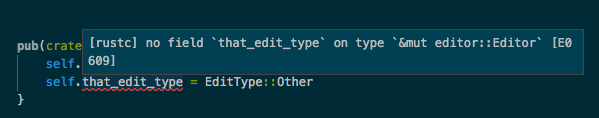
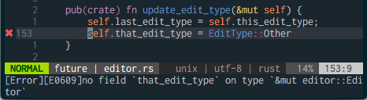
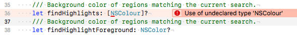

# RFC: Annotations

_In which we propose the concept of and a draft API for ‘Annotations’,
a new way for core and plugins to represent additional information about
regions of a document._

## Summary

Add ‘annotations’, a new concept and API for the representation of
transient document state. This provides a flexible mechanism for
representing a wide variety of core and plugin information to the
frontend, without using the text styling API.

This API will be the basis for a wide variety of future features,
including things like:

- compiler warnings / lints / diagnostic messages
- displaying other user's cursors during multi-user editing
- clickable external links
- version control status
- breakpoints

Additionally, it will be used to represent the user's _selections_ and
_find highlights_.

The text styling API will not be materially changed as a result of this
proposal, although it will be slightly simplified.

## Overview

_Annotations_ are a very simple abstraction. The basic idea is to
generalize the common pattern of having some _type_ of data associated
with some set of document _regions_. Annotations themselves have types,
and these types determine the expected structure of a given annotation's
data, or payload. How (and whether) to handle a given type of annotation
is left up to the frontend, although suggestions or guidance may be
provided.

We will add an `annotations` field to the update protocol. This field
will be a list of sets of annotations, which will represent _transient
state_ scoped to the current view. Each annotations set will include
a type identifier and two arrays, one of start/end ranges (likely
represented as a visual line number + utf8 or utf-16 offset) and one
of corresponding payloads. In sort-of JSON, this might look like:

```javascript
// in the update object:
{
    "ops": [Op]?,
    "annotations": [AnnotationSet]?,
    // other fields
}

// An AnnotationSet:
{
    "type": String,
    "ranges": [[Position, Position]],
    "payloads": [Any]?,
    "metadata": Any? // maybe?
}
```

The expected values for `metadata` and `payload` would be determined by
the `type` of the annotation. We will define _some_ annotation types and
their expected structure, but a plugin is free to define new annotation
types, and a frontend is free to support these.

Initially, we will support two annotation types: `selection` and `find`.
These will represent the user’s selections and their active find
highlights. These two features are currently handled by the styles
system; for a preliminary period we will continue support for them
there, but at some point that will be removed, and this data will be
provided as annotations only. Frontends will be required to update to
the new protocol.

In addition, in this RFC we will also be considering a  third example:
diagnostics, such as the output from linters or compilers. We will also
provide a number of other examples.

## Motivation

This change has a number of motivations.

### Separate view state from style spans

Selections and find highlights are currently included as a special case
of _styles_. This has always been a bit of a hack. _Styles_ represent
the appearance of a _document_. For a given document and a given theme
(ignoring for now the question of different style providing plugins)
styles should never change.

Selections and find highlights are different; they are transient state,
linked to a particular view. Updating them should not require us to
invalidate and resend lines; we should just send the new highlights or
selection state. (**n.b.**: Something like this the intended role of the
"update" operation in the previous version of the update protocol; that
operation can be removed with this change.)

### Greater frontend design flexibility

We want frontends to have flexibility in how they present their UI. We
would like xi to be used as the basis for editors on a variety of
devices and form-factors; and even for a given device, we would like
frontend designers to have the freedom to experiment with new ideas.

Annotations provide the frontend with scoped, semantic information,
without declaring how it should be displayed. In certain cases (such as
with selections or find results) we might provide _suggestions_ about
how something might be displayed (for instance, selections should use
the selection color defined in a theme) but the frontend is free to
ignore this.

### Enable new features

In the near future we would like to start adding support for a variety
of features that require coordination between a plugin and the frontend,
such as when displaying diagnostic messages or version control status.
Both of these features can be built on annotations: a simple version of
diagnostics are spans where the payload is a diagnostic level and
a message, e.g. "warning", "unused import: `std::marker::PhantomData`".
It's easy to imagine augmenting this payload in the future to include
things like a quick-fix edit to apply, or a link to documentation. For
version control status, the payload could indicate whether ranges were
added, modified, or removed.

### Accessibility

In the future, we would like to be able to support screen readers and
other assistive devices. By having semantic information included
alongside (as opposed to crammed together with) document contents, these
features should be easier to implement.

## Detailed Explanation

### In core

Core will get some new `Annotations` type that will look something like:

```rust
type AnnotationType = String;

/// A set of annotations of a given type.
struct Annotations {
    items: Spans<Value>,
    type_id: AnnotationType,
}

/// A region of an `Annotations`; this is the type we put on the wire.
struct AnnotationSlice {
    type: AnnotationType,
    /// guaranteed non-descending start order
    ranges: Vec<(usize, usize)>,
    /// If present, one payload per range.
    payloads: Option<Vec<Value>>,
}
```

This may at some point get a fancier implementation (more generics) but
this is the basic structure. Types (such as `Selection`) that will be
represented as annotations on the wire, will be able to implement a new
conversion trait, something like:


```rust
/// A trait for types (like `Selection`) that have a distinct representation
/// in core but are presented to the frontend as annotations.
trait ToAnnotation {
    /// Returns annotations that overlap the provided interval.
    fn get_annotations(&self, interval: Interval) -> AnnotationSlice;
}
```

Annotations from _plugins_ will be stored per-view:

```rust
struct View {
    // .. other state
    // Annotations provided by plugins
    annotations: AnnotationStore,
}

/// All the annotations for a given view
struct AnnotationStore {
    // impl TBD, we want quick lookup based on plugin and based on type.
    // we also may want to pre-merge spans of a given type, as they come in?
}

impl AnnotationStore {
    /// Applies an update from a plugin to a set of annotations
    fn update(&mut self, source: PluginId, type_id: String, range: Range, items: Vec<_>) { }
    /// Returns an iterator which produces, for each type of annotation,
    /// those annotations which intersect the given interval.
    fn iter_range(&self, interval: Interval) -> impl Iterator<Item=AnnotationSlice> { }
    /// Removes any annotations provided by this plugin
    fn clear(&mut self, plugin: PluginId) { }
}
```

When updating the frontend, we will take the current visible range, and
grab all the annotations that intersect that range:

```rust
// in the function preparing the update (say send_update_for_plan)
// let ops = something;
// let pristine = sure;

let start_off = self.offset_of_line(self.first_line);
let end_off = self.offset_of_line(self.first_line + self.height + 1);
let visible_range = Interval::new(start_off, end_off);
let annotations = iter::once(self.selection.to_annotation(visible_range)
    .chain(self.find.iter().map(|f| f.to_annotation(visible_range))
    .chain(self.annotations.iter_range(visible_range)
    .collect::<Vec<_>>();

let params = json!({
        "ops": ops,
        "pristine": pristine,
        "annotations": annotations,
    });

client.update_view(self.view_id, &params);
```

***future work***: At some point we may want to explore something like
minimal invalidation for annotations; for a simple approach we could
imagine not resending annotations of a given type when they are
unchanged. For the time being, the simplicity of being entirely
stateless is appealing.


### In the frontend

The annotation wire format is intended to be handled efficiently by
frontends, particularly when drawing. Specifically, the annotations sent
should include only those necessary to draw the current screen. within
a type of annotations, items are in sorted, ascending order, meaning
they can be processed in order, keeping a single index into both the
offset and payload arrays.

#### Annotations are stateless

To the frontend, annotations are _stateless_. By this we mean that
a given update will include the full set of annotations that intersect
with the currently visible region; the client will not be expected to do
any caching or merging. (As a possible optimization we might consider
making this be true only _per type_; so that once received, annotations
of a given type are considered valid until new annotations of that type
are received.)

#### Each type of annotation has a defined payload type.

The payload associated with a given annotation is determined by the type
of the annotation. We anticipate defining a set of types and their
corresponding schemas as part of the xi-editor project, and more may be
added in the future; but new types could also be defined by a plugin,
and as long as they're supported by a frontend that's fine.

Some examples of possible types and their possible payloads:

**'`selection`'**: The payload for a selection is simply the location in
the selection of the cursor. This might be represented by a number in
`[0, 1, 2]`, corresponding to 'start', 'end/upstream', or
'end/downstream'.

**'`link`'** A link's payload might be a url string.

**'`diagnostic`'** A diagnostic's payload might be an object including
a level (e.g. warning, error, note), a short message string, and
a longer detail string.


#### The frontend chooses how to display annotations based on their type.

The type of an annotation (and its documentation) should hint at how it
might be displayed, but this choice is ultimately up to the frontend.
Take for example a diagnostic warning annotation; a gui frontend might
choose to show the warning inline, drawing over the text, but a tui
frontend might only show an indicator in the gutter area:

<br> _A language
server error in Visual Studio Code_ <br>

<br> _A language
server error in Neovim_

<br> _An error in Xcode, just for
variety_

### plugin API

Plugins add, update, and remove annotations with a single protocol
method:

```javascript
{
    "method": "update_annotations",
    "params": {
        "view_id": "view-id-3",
        "rev": 4137193,
        "type": "diagnostics",
        "range": [0, 1337],
        "items": [ /* some annotations */],
    }
}
```

Each plugin can modify its own annotations. Each annotation _type_ is
stored separately.

#### Plugins update annotations during editing.

Annotations will be adjusted or removed in core, during editing. (The
particulars of this are undecided; there may be different update
strategies for different annotation types, or we may just destroy
annotations when an edit occurs in their interior.) In either case, the
plugin is expected to remove or update any existing annotations in
response to a user's edits.

### Example: diagnostic messages

Consider the case of a a linting / diagnostic plugin; in particular
let's imagine a simple plugin that wraps the  `cargo check` command,
running it in the background when a file is saved.

In the case of our `cargo check` plugin, it would run `cargo check
--message-format=json`, capture the output, and then extract it into
something like:

```javascript
// AnnotationSet
{
    “type”: "diagnostic",
    "ranges": [[420, 456]],
    “payloads”: [
        {
            "level": "warning", // warning / error / info / ?
            "message": "unused import: `std::marker::PhantomData`",
            "code": "unused_import"
    ],
    “metadata”: null
}
```
This annotation set would be sent to core, which would then forward it
to the frontend to display as desired.

## Questions / considerations

A number of things have come up while drafting this proposal that are
worth noting.

#### metadata handling

We probably want (and have assumed having, elsewhere in this proposal)
some way to associate metadata with a _set_ of annotations;
for instance 'find' annotations might include the total
number of results and their approximate locations. This does add some
complexity, however, and it isn't totally clear that it makes sense as
part of this API; it might make more sense to have a separate 'metadata'
API, which could provide metadata for certain types of annotations as
well as other purposes (for instance, this might be a better way of
communicating when a buffer has unsaved changes.)

#### zero-width annotations
If we would like to indicate a 'removed range' in a version control
plugin, it would make sense to communicate this as a zero-width
annotation. This will also be necessary for selections. So less
a question than something to be explicit about.

#### type checking and validation
regardless of how we actually represent annotations in core,
we would like to have some mechanism for
validating them (at least those of known types) so that we aren't
forwarding malformed data blindly to the frontend.

#### fetching ranges of annotations
Since we only send the visible annotations to the frontend,
we may want to expose some sort of API to allow fetching annotations
for other regions of the document.
This is definitely 'build it when you need it' territory.

#### More efficient invalidation
We may find that in use we end up with lots of redundant annotations
in the update RPC; for instance when the user is actively editing
and/or moving through a document we may find ourselves resending
large numbers of unchanged annotations. If this ends up being
the case, we may want to explore more explicit invalidation strategies.

#### Updating annotations in response to edits
When text is inserted interior of a selection, we expand selection
to include the new text. When text is inserted in the interior of
a _style_ span, we split the existing span in two and insert an
empty span for the inserted text. What should we do when an edit
occurs inside an annotation?

The 'correct' behaviour is highly dependent on the type of the
annotation. If we had to choose a single behaviour, I think we would
want to either destroy modified annotations or to expand them, like
selections; but we may want to have an 'update strategy' that is
determined by the annotation's type.

#### Annotations for inter-plugin communication
A far future concern: but we may want to explore whether annotations
also make sense as a mechanism for plugins to communicate metadata
to one another.

#### Sharing annotations between views
It may make sense for certain types of annotations to be shared between
multiple open views into the same buffer. As we do not currently support
multiple views, this can be considered future work.
