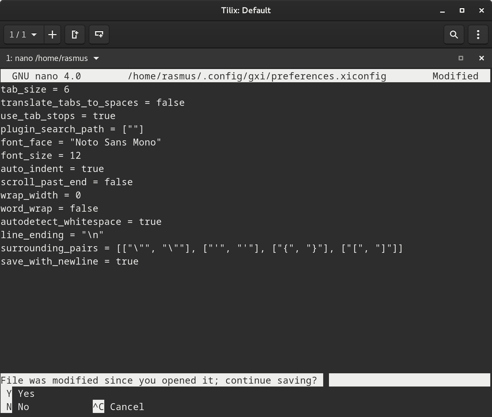
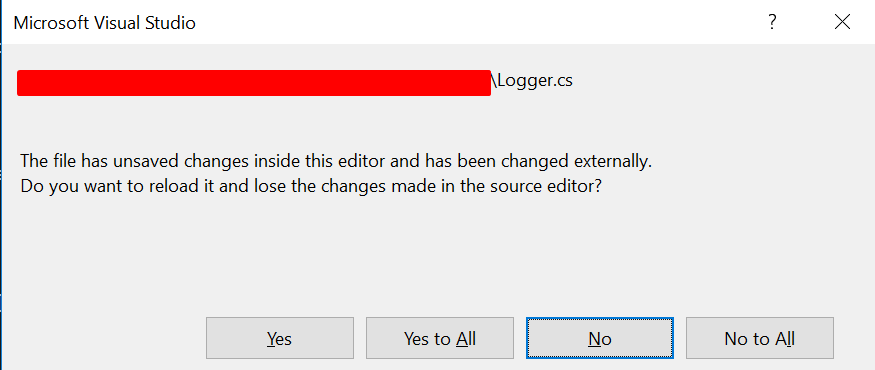

# RFC: Acting upon an externally changed file

Right now Xi only has two mechanisms to handle externally changed files:

* Blocking saving, instead requiring the user to save the file elsewhere
* Automatically reloading the file if no changes have been done

Blocking saving is a bit annoying, especially if the user _does_ want to overwrite
the file (e.g. when a git rebase has modified a file's modtime).

## Summary

For this to work we have to change multiple thing:

- Add a new notification ('file_externally_changed')
	- Frontends may use this to display a 'File has been changed, want to reload?' dialog
- Add a way for frontends to force reload the file to implement the previously mentioned dialog
- Add a way for frontends to force save the file, e.g. via a 'force' param to 'save'

### Force saving

There are multiple ways to tacle this:

1.
If the frontend sends 'save' with 'force: false' and the file has been changed
externally, then Xi should send another notification back, e.g. 'save_failed'
upon which the frontend can display a save dialog like "The file has been changed,
do you really want to overwrite it?".
	- Nano does that. First you save via Ctrl+O, after pressing enter the
	  following dialog comes up:
	  

2.
Don't allow force saving at all. Other editors such as VSCode and VSStudio do
exactly that it seems and instead just notify the user on file changes and offer them
a way to reload the file. At least VSCode does offer a built-in way to show the user a
diff between the old and the new file, which helps resolving conflicts.

I'd personally prefer offering an option to force save though, as 'save_as' and
then moving the file after a rebase is a bit tedious :)

## Necessary API changes in Xi

I would personally prefer having API to allow both of these possible ways to handle this to be used by frontends.
For this we need:

1. The previously mentioned 'file_externally_changed' notification, to allow frontends displaying a dialog
saying that the file has been changed
2. A way to demand a reload of the file by the frontend to act upon the 'file_externally_changed' notification
3. A way to force saving the file, even if changes have occured, e.g. via a 'force' paramter for 'save'
