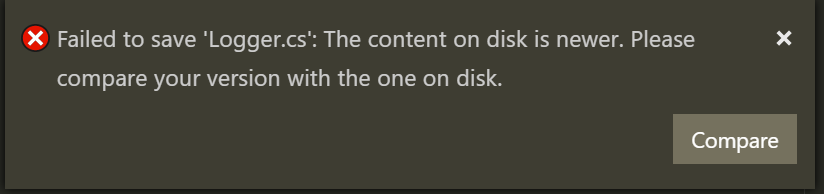

# RFC: Acting upon an externally changed file

Right now Xi only has two mechanisms to handle externally changed files:

* Blocking saving, instead requiring the user to save the file elsewhere
* Automatically reloading the file if no changes have been done

Blocking saving is a bit annoying, especially if the user _does_ want to overwrite
the file (e.g. when a git rebase has modified a file's modtime).

## Summary

For this to work we have to change multiple thing:

- Add a new notification ('file_externally_changed')
	- Frontends may use this to display a 'File has been changed, want to reload?' dialog
- Add a way for frontends to force reload the file to implement the previously mentioned dialog
- Add a way for frontends to force save the file, e.g. via a 'force' param to 'save'

### Force saving

There are multiple ways to tacle this:

1.
Let the frontend remember that is has received a 'file_externally_changed' so it
can display a save dialog with options like "force save|save as|cancel".
	- This is problematic as we'd have to keep this in sync with Xi

2.
If the frontend sends 'save' with 'force: false' and the file has been changed
externally, then Xi should send another notification back, e.g. 'save_failed'
upon which the frontend can display the previously mentioned save dialog.
	- Nano does that. First you save via Ctrl+O, after pressing enter the
	  following dialog comes up:
	  

3.
Don't allow force saving at all. Other editors such as VSCode and VSStudio do
exactly that it seems:

I'd personally prefer offering an option to force save though, as 'save_as' and
then moving the file after a rebase is a bit tedious :)
